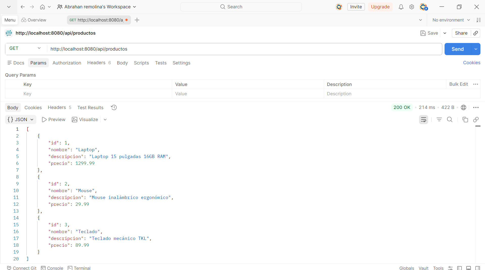
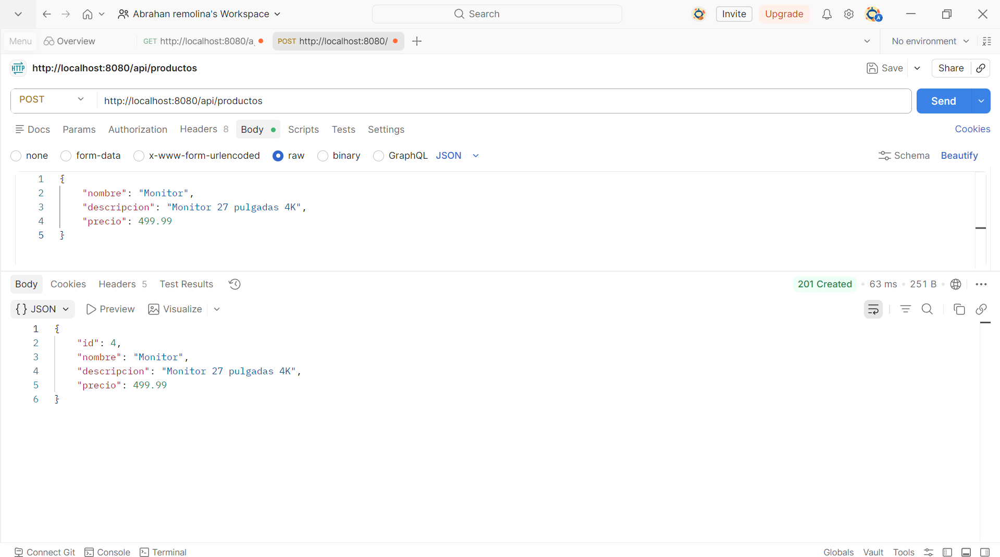
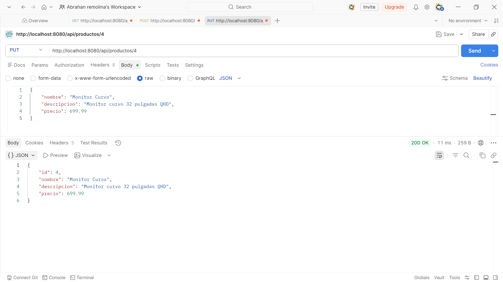
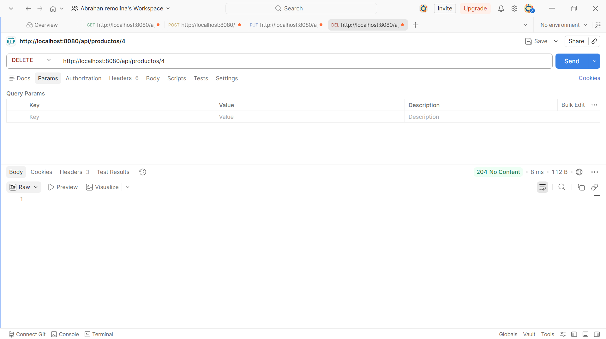
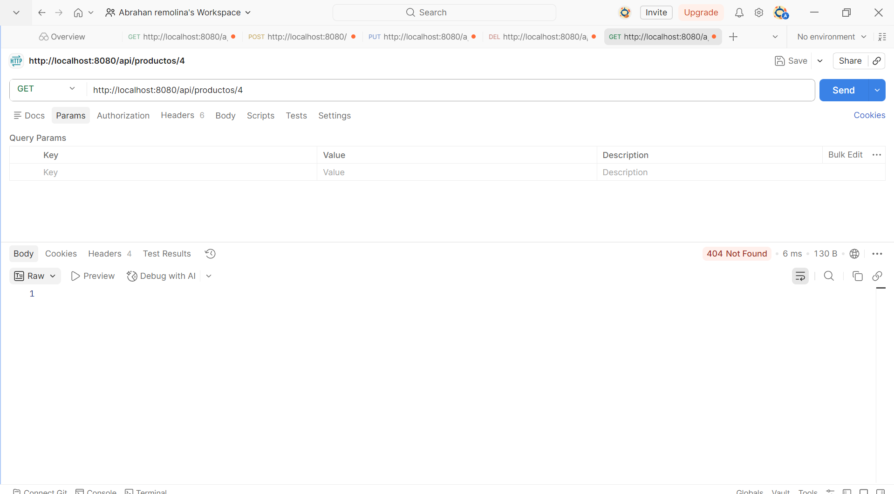
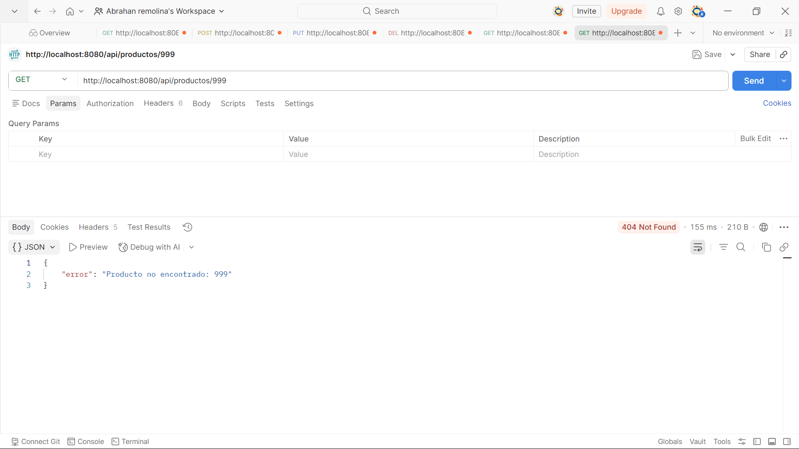

# API REST de Productos - Spring Boot

API REST CRUD para gestión de productos desarrollada con Spring Boot y @RestController.
Proyecto correspondiente a la Unidad 7 (Post-Contenido 2) de Programación Web - Ingeniería de Sistemas 2026.

## Tecnologías utilizadas

- Java 17
- Spring Boot 3.2.x
- Jackson (incluido en Spring Web para serialización JSON)
- Maven
- Spring Boot DevTools

## Estructura del proyecto

    src/main/java/com/universidad/apiproductos/
    ├── model/
    │   └── Producto.java                
    ├── service/
    │   └── ProductoService.java         
    ├── controller/
    │   ├── ProductoApiController.java    
    │   └── GlobalExceptionHandler.java   
    └── ApiProductosApplication.java      

    src/main/resources/
    └── application.properties

## Cómo ejecutar el proyecto

**1. Clonar el repositorio**

    git clone https://github.com/Abrahan07/ProWeb-Remolina-post2-u7.git
    cd ProWeb-Remolina-post2-u7

**2. Ejecutar la aplicación**

    mvn spring-boot:run

**3. La API estará disponible en**

    http://localhost:8080/api/productos

> Requiere Java 17 o superior instalado.

## Endpoints de la API

| Método | URL | Código éxito | Código error | Descripción |
|--------|-----|--------------|--------------|-------------|
| GET | /api/productos | 200 OK | — | Retorna la lista completa de productos en JSON |
| GET | /api/productos/{id} | 200 OK | 404 Not Found | Retorna el producto con el ID indicado |
| POST | /api/productos | 201 Created | 400 Bad Request | Crea un nuevo producto con el JSON del body |
| PUT | /api/productos/{id} | 200 OK | 404 Not Found | Reemplaza los datos del producto existente |
| DELETE | /api/productos/{id} | 204 No Content | 404 Not Found | Elimina el producto con el ID indicado |

## Ejemplos de uso

**Crear un producto (POST)**

    POST http://localhost:8080/api/productos
    Content-Type: application/json

    {
        "nombre": "Monitor",
        "descripcion": "Monitor 27 pulgadas 4K",
        "precio": 499.99
    }

**Actualizar un producto (PUT)**

    PUT http://localhost:8080/api/productos/1
    Content-Type: application/json

    {
        "nombre": "Monitor Curvo",
        "descripcion": "Monitor curvo 32 pulgadas QHD",
        "precio": 699.99
    }

## Manejo de errores

La API devuelve respuestas JSON estructuradas para los errores gracias al GlobalExceptionHandler:

    GET http://localhost:8080/api/productos/999
    → 404 Not Found
    → { "error": "Producto no encontrado: 999" }

## Capturas de pantalla

### GET - Listar productos (200 OK)

### POST - Crear producto (201 Created)

### PUT - Actualizar producto (200 OK)

### DELETE - Eliminar producto (204 No Content)

### GET - Producto no encontrado (404 Not Found)

### GET - Error con mensaje JSON (404 Not Found)

